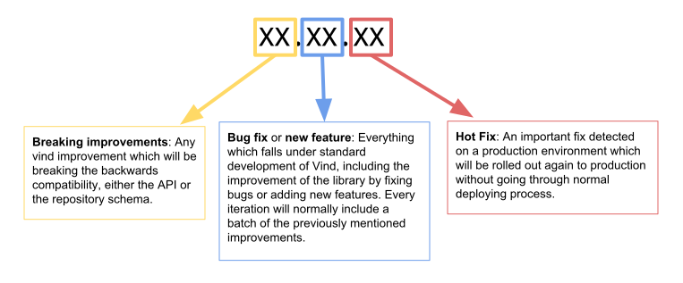

# VIND

Vind (faɪnd) is a modular Java library which aims to lower the hurdle of integrating information discovery facilities in Java projects.
It should help programmers to come to a good solution in an assessable amount of time, improve the 
maintainability of software projects, and simplify a centralized information discovery service management including monitoring and reporting.

## Design principles

In Vind we try to design an API which follows this 3 design principles:

**1. Versatility:** Vind will be used in many different projects, so it was an aim to keeping the dependency footprint small, 
which avoids version-clashes in the downstream projects.

**2. Backend Agnostic:** Wherever possible and feasible, the library has to abstracted from the basic search framework. This enabled us to change the
backend without migrating application software.

**3. Flat learning curve:** It was an aim to keep the learning curve rather flat, so we tried to use Java built-in constructs whenever possible. Additionally
we tried to follow the concept: easy things should be easy, complex things can (but does not have to) be complex.

The search lib is modular and currently implements the following layers:

## Versioning & release policy

Each Vind release is labeled in the repository with a tag fitting the following schema: _vind-va.b.c_ where 
**vind-v** just points out that this belongs to a Vind version and **a.b.c** represents the release number, also used 
for the artifact version. Prior to **vind-v1.3.0** there was not a clear policy on versioning.

From __1.3.0__ on releases will strictly stick to the following diagram:

Regarding the release process, prior to every non _hot fix_ release, a **release candidate** would be published to be tested 
on an staging environment as close as possible to production. These releases will apply the previous described name schema 
followed by _RCa_ suffix, being **a** the release candidate iteration number. 
I.e., _vind-v1.3.0-RC1_ would be the first release candidate for version 1.2.6 which, if rejected due to bugs found in 
staging environment, will be released again after fixing as __vind-v1.3.0-RC2__. After approval, the artifact will be released
as **vind-v1.3.0**.

From **vind-v1.3.0**, all the hot fixes will be handle in a release specific maintenance branch, that means development 
branch should always be in an _a.b.0-SNAPSHOT_ **Vind** version.

## Roadmap

If you'd like to get a deeper look into the lib or if you are interested in our future goals just [have a look at 
our blog series](https://rbmhtechnology.github.io/blog/tag/vind/).
There we give an outlook on the next development steps and introduce new features.

## How to use

The modules of the Vind lib are provided as Maven artifacts and thus can be seamlessly integrated in new and existing Java Software
projects. Vind decouples API and the *real* indexing components. The first backend which is also the reference implementation is build
on top of [Apache Solr](http://lucene.apache.org/solr/). The lib integrates an in-memory indexer on top of an Embedded Solr Server 
which enables developers to start without setting up a complex infrastructure. Furthermore Vind includes a backend maintainance component
which makes it easy to setup Vind index collections and keep them in sync with the Vind version.

[Get a detailed documentation of all functions and features](https://rbmhtechnology.github.io/vind/) 
or [dive deeper in the API of the Vind with Javadoc](https://www.javadoc.io/doc/com.rbmhtechnology.vind/vind). 

## How to contribute

Vind is an Open Source project so everyone is encouraged to improve it. Don't hesitate to report bugs, provide fixes or
share new ideas with us. We have various ways for contribution:

* use the issue tracker - report bugs, suggest features or give hints how we can improve the documentation.
* discuss issues with the community - two brains are better than one.
* write code - no patch is too small. So even fixing typos helps to improve Vind.

## Release Process

* **Snapshot**: Pushes to branch `develop` are automatically deployed to [sonatype snapshots](https://oss.sonatype.org/content/repositories/snapshots/com/rbmhtechnology/vind/).
  Current version: 

* **Release**: Stable releases need to be performed manually:
    1. make sure all changes have been pushed to the repository and all tests are working fine.
    1. run `mvn release:prepare`
    1. run `mvn release:perform`
    1. run `(cd target/checkout; mvn nexus-staging:release)`
    1. push changes to the repository `git push && git push --tags`

## License
Free use of this software is granted under the terms of the Apache License Version 2.0.
See the [License](LICENSE) for more details.

## Authors
Vind is lead by [Red Bull Media House Technology](https://github.com/RBMHTechnology) and was initiated in 2017.

## Changelog
The [Changelog](https://rbmhtechnology.github.io/vind/changelog) provides a complete list of changes in older releases.
