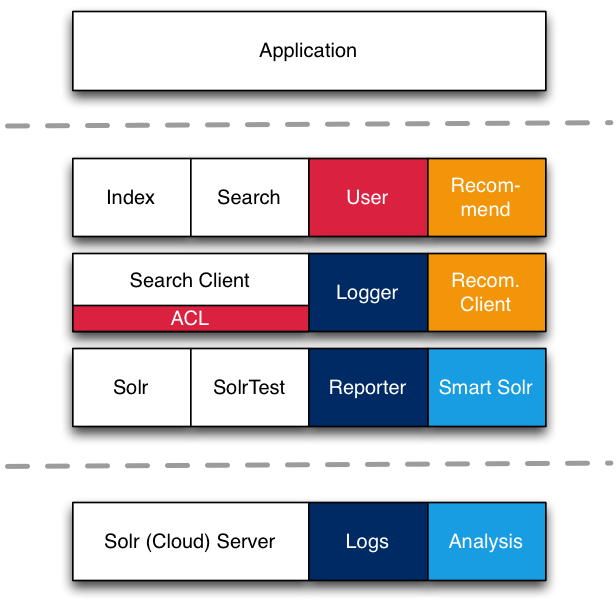

{:.blogtitle}
## Vind - Information Discovery for Java

<h3 class="author author-thomas">
    <a href="https://github.com/tkurz">Thomas Kurz</a>
    <span class="date">2017-10-09</span>
</h3>

{:.summary} 

We all know it. When dealing with application development we often face the same problem again and again.
When a problem comes up for the first time you study it, think about a proper solution, search for fitting technology
and build the solution which fits best. For the second time, you reuse some code (by copy-paste), debug it and make it
fitting. No later than for the third time this approach... sucks. Copy-pasting often produces sub-optimal results and
(which is even worse) causes bugs that you have to find and fix. Additionally this enlarges the codebase you have to
maintain and forces you to develop and test new features for all applications individually. 

In our case the recurring problem was the integration of custom search facilities including reporting, analysis,
personalization and recommendation - a topic that we call *Information Discovery* (ID) on which we have been working on for almost a decade.
What we did is: we sat down, thought about proper scenarios and packaged these into a modular framework which provides you with an easy to use API, abstracts the complexity of the real ID tasks and thus lets you focus on the other parts of your application - things that you are expert in.

So let me kindly introduce to you Vind (faɪnd) - a modular Java framework for Information Discovery.

## Do you know this issue? Then you are at the right place!

Let me start with a simple example. Imagine your application provides blog posts with title, description and date.
It is obvious, that a search on the blog posts would be a great feature for your app. By using Vind this feature is just
a view steps ahead:

### 1. Include Vind by dependency

```xml
<!-- in this case we use the embedded solr server -->
<dependency>
    <groupId>com.rbmhtechnology.vind</groupId>
    <artifactId>embedded-solr-server</artifactId>
    <version>${vind.version}</version>
</dependency>
```

### 2. Create a Pojo with annotations

```java
class Post {
    
    // The @id annotation is obligatory for the identification of your blog posts within Vind
    @Id
    private String id;
    
    // The fulltext annotation means: 'use this for fulltext search'.
    // The language enables a language specific handling on indexing an query time
    // The boost leads a a better ranking if (parts of) the title matches the query.
    @FullText(language = Language.English, boost = 1.2f)
    private String title;
    
    // The @Facet annotation enables faceting and filtering on this value
    @Facet
    private String category;
    
    // A field which is not annotated is not used for fulltext search but stored, 
    // so it can be used for sorting
    private ZonedDateTime created;
}
``` 

### 3. Index and Search Pojos
```java
// Get an instance of a server (in this case a embedded solr server)
SearchServer server = SearchServer.getInstance();

// Index a Post
server.indexBean(my_new_post);

// Don't forget to commit
server.commit();

// Search for blogs of type 'news' that contain 'cool stuff' 
FulltextSearch search = Search
    .fulltext("redbull release")
    .facet("category","news");

BeanSearchResult<Post> result = server.execute(search, Post.class);
```

That's it. Your applications now includes a simple search functionality.
Of course, Vind can do much more things, but we follow a simple paradigm:

> No expert? No problem! Which means: easy things should be easy to do.

So if your application has more sophisticated requirements on ID, Vind can still support
many of them, whereby the code may be more complex. But we still try to keep it simple ;)

## Mhh, Vind - interesting. But what's its real power?

Vind does not only provide you with annotation based indexing and simple search facilities.
It is rather meant to support you with the whole *Information Discovery* environment, that also includes logging,
adaption, evolution, and recommendation. This stack shows all the components that are planned
for Vind.

{:.img-medium-center}


As it is the basis for all the further work we started with the definition and implementation of the
basic features - indexing and searching. Vind can be splitted into two parts, client and server. The lib thereby
has the goal to be backend agnostic but we started with [Apache Solr](http://lucene.apache.org/solr/),
a widespread and enterprise proven search server, as a first implementation basis.

### Already in place

* **Search Client:** Includes the whole API definition for indexing (annotation and field-descriptor based) and search (bean-based as well as type-save).
* **Solr Client:** Implements the API on top of the Solr framework.
* **Solr Server:** Contains Solr configuration, specific Solr components, utilities for backend management and a Test environment.

### Currently in progress

* **Logging:** Enables logging of all interactions (indexing, search, result access)
* **Reporter:** Includes utils to analyze the logging (data condense, visualization)

### Plannend in the midterm

* **Analysis:** Allows to analyze and use logging results for search improvements (ranking, suggestions, etc)
* **Smart Search:** Adds natural language components and workflow detection for a more natural behaviour

### Planned in the longterm
* **Recommendation:** Includes analysis based clustering, personalization and history based recommendations (filters, ranking, etc.)

## Cool! But how to start now?

There are several ways, how you can get familiar with the whole Vind modules.

* [Fork the repository](https://github.com/RBMHTechnology/vind)
* [Read the documentation](https://rbmhtechnology.github.io/vind)
* [Follow the blog posts](https://rbmhtechnology.github.io/vind/blog/)
* [Contact us on gitter](https://gitter.im/RBMHTechnology/vind)

Have fun, we hope you enjoy Vind! And if you have any questions, feature requests or bug report: Please get in touch with us!
